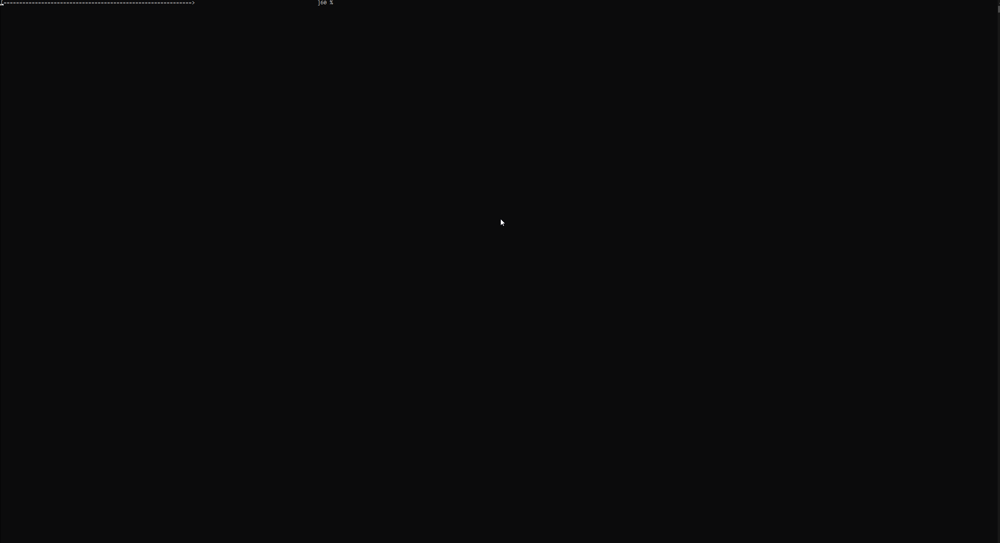
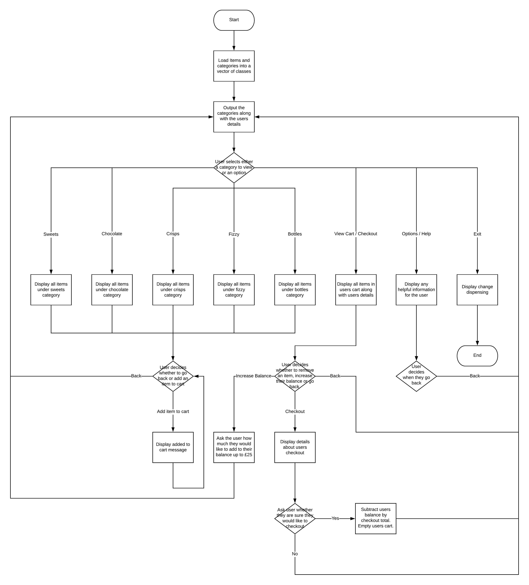

# Vending Machine

This is an object orientated C++ console application. It has been built to behave as if it is a real vending machine. This means that all features should behave as close as possible to that of a real vending machine (with some leniency).

### Screen capture

### Flowchart diagram

To run this application simply download and find the .exe in the "application folder", double click this and start using the vending machine.
